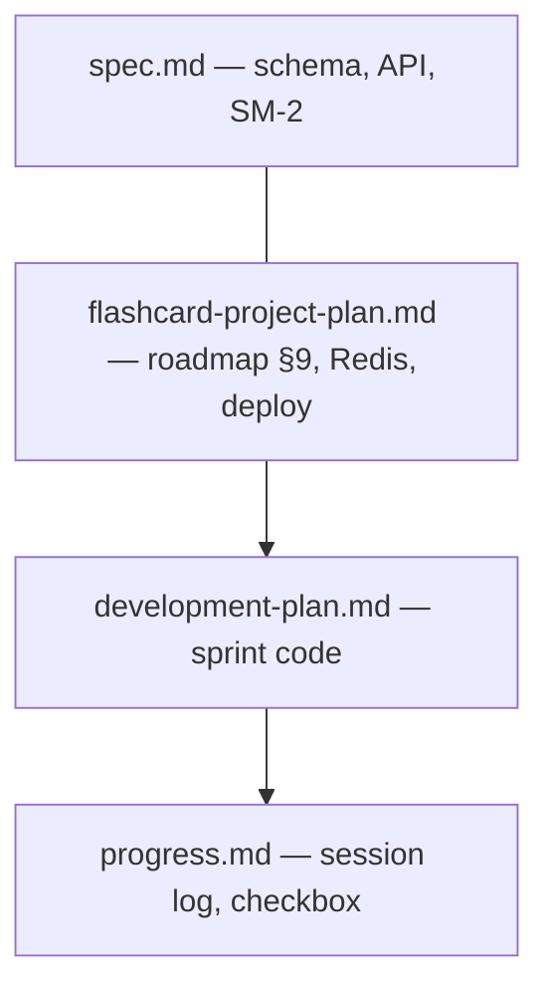

# Tài liệu Lumotus

Mục lục tài liệu dự án. **Quick start** vẫn ở [`README.md`](../README.md) tại root.

---

## Phân cấp & nguồn sự thật

| Vai trò | File | Khi nào sửa |
|---|---|---|
| **Đặc tả kỹ thuật** | [`spec.md`](spec.md) | Schema, endpoint, business rule — luôn đồng bộ với code |
| **Roadmap & thứ tự nghiệp vụ** | [`flashcard-project-plan.md`](flashcard-project-plan.md) §9 | Đổi ưu tiên tính năng (vd. Import trước SRS) — **sửa file này trước** |
| **Chia sprint / branch** | [`development-plan.md`](development-plan.md) | Sau khi §9 ổn → map sang Sprint 0–6 |
| **Tiến độ thực tế** | [`progress.md`](progress.md) | Cuối mỗi buổi: checkbox + session log |
| **UI / Figma** | [`ui-design-plan.md`](ui-design-plan.md), [`figma-wireframe-spec.md`](figma-wireframe-spec.md) | Thiết kế màn hình |

**Thứ tự đồng bộ khi có thay đổi lớn:** `spec.md` + `flashcard-project-plan.md` → migration/API code → `development-plan.md` → `progress.md`.

---

## Bắt đầu từ đâu?

| Mục đích | File |
|---|---|
| **Tiến độ & session hôm nay** | [`progress.md`](progress.md) |
| **Thứ tự code (sprint)** | [`development-plan.md`](development-plan.md) |
| Schema, API, SM-2 | [`spec.md`](spec.md) |
| Roadmap dài hạn, Redis, deploy | [`flashcard-project-plan.md`](flashcard-project-plan.md) |
| Design system, màn hình FE | [`ui-design-plan.md`](ui-design-plan.md) |
| Wireframe Figma | [`figma-wireframe-spec.md`](figma-wireframe-spec.md) |

---

## Quy ước

- Đổi **schema / index** → cập nhật **cả** `spec.md` §2.2–2.3 **và** `flashcard-project-plan.md` §2.2–2.3 trước migration.
- Đổi **thứ tự sprint** → `flashcard-project-plan.md` §9 trước, rồi `development-plan.md`, rồi checklist `progress.md`.
- Sau mỗi buổi làm việc → cập nhật [`progress.md`](progress.md) (session log + checkbox).
- Không sửa file Flyway đã chạy — chỉ thêm `V{n}__*.sql`.

---

## Figma (team)

- File wireframe: [Lumotus — Wireframes](https://www.figma.com/design/Ar70HHusN5Ladp7d6jPRFx)
- `fileKey`: `Ar70HHusN5Ladp7d6jPRFx`
